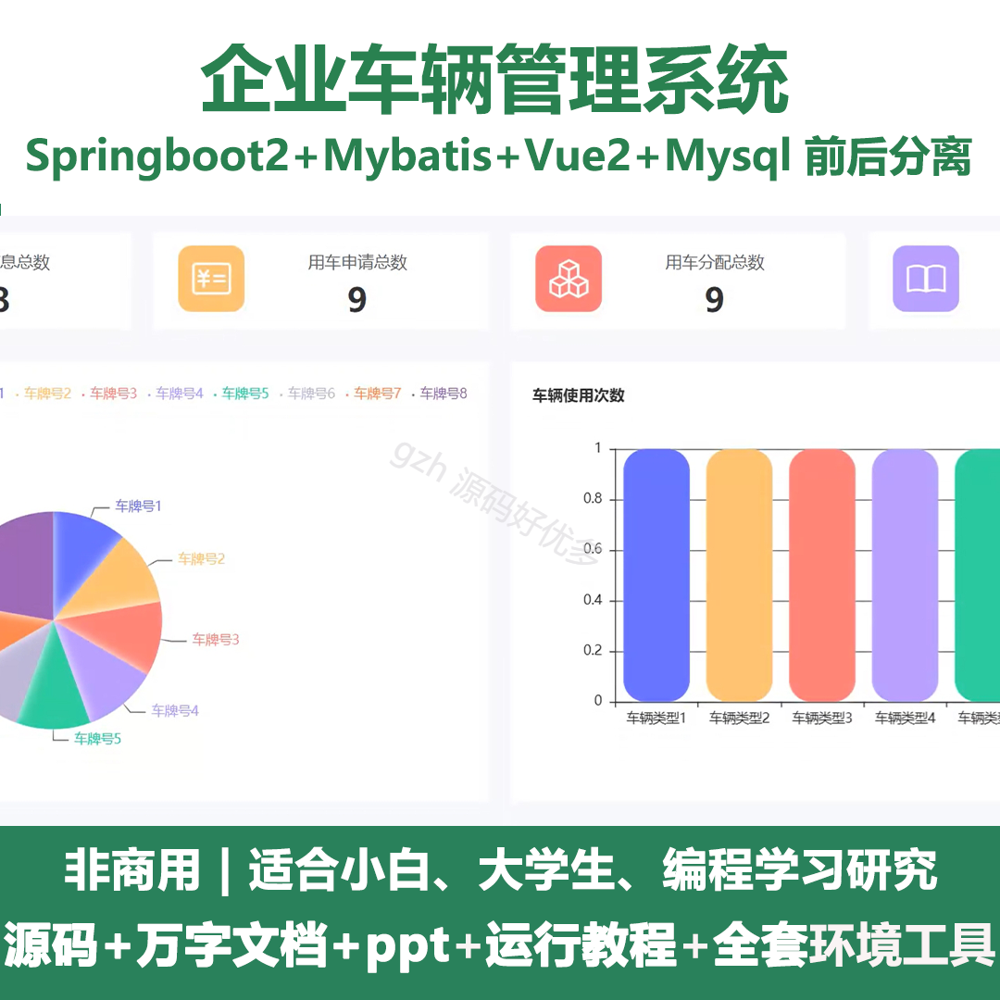
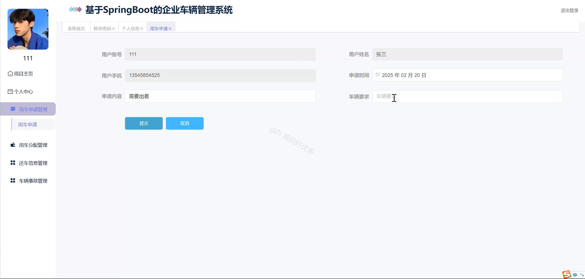
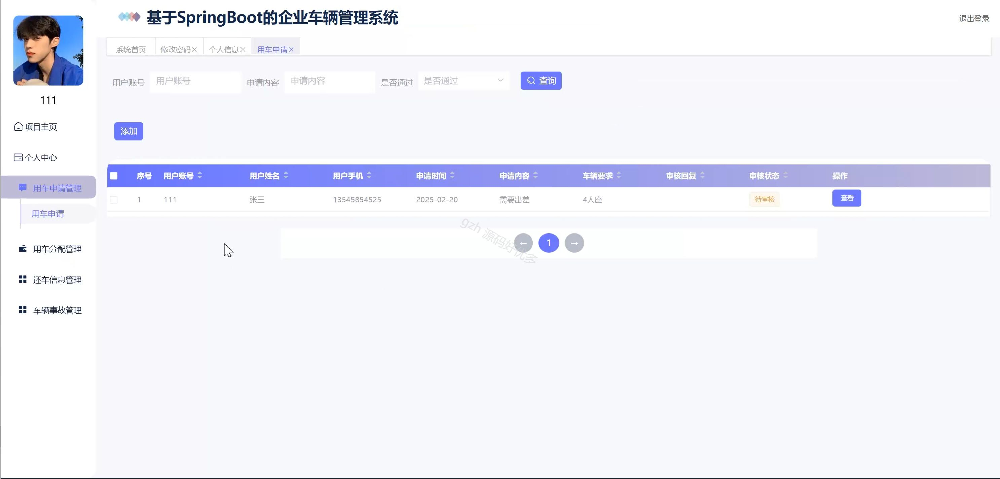
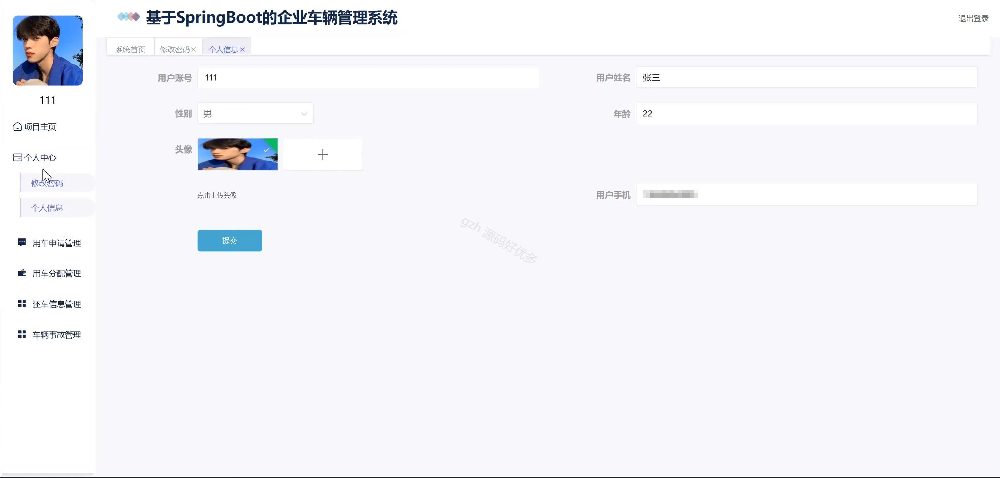
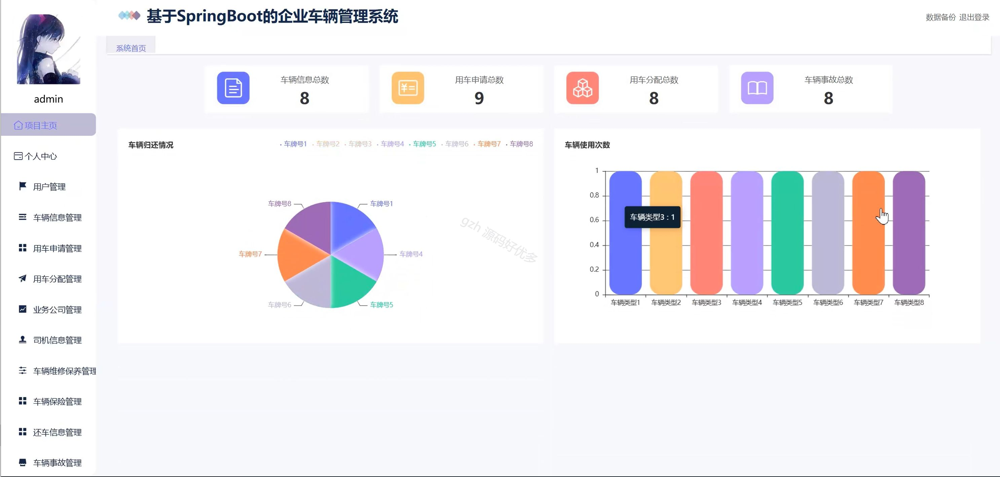
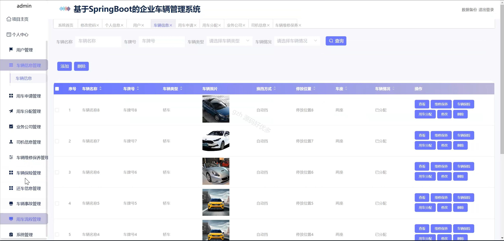
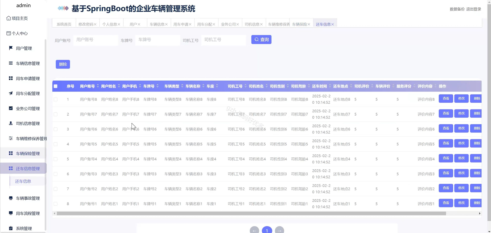
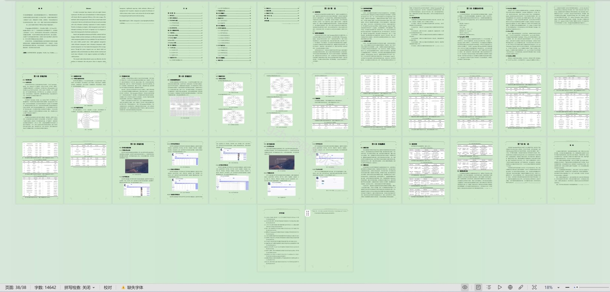

# springbootA513D
springbootA513D企业车辆管理系统
## 查看主页获取源码

### 一、关键词

用车申请管理、用车分配管理、车辆维修保养管理

### 二、作品包含

源码+数据库+设计文档万字+ppt+全套环境和工具资源+部署教程

### 三、项目技术

前端技术：Html、Css、Js、Vue2.0、Element-ui 
后端技术：Java、SpringBoot2.0、MyBatis

  

### 四、运行环境（以下版本亲测，其他版本未知，请自测）

开发工具：IDEA/eclipse  + VSCODE

数据库：MySQL5.7（最低要5.7版本）

数据库管理工具：Navicat10以上版本

环境配置软件： JDK1.8 + Maven3.6.3

前端Nodejs：14

浏览器：谷歌浏览器

### 五、项目介绍

项目编号：springbootA513D

企业车辆管理系统通过对车辆进行数字化、智能化管理，提升车辆使用效率，降低运营成本，保障行车安全，优化企业车辆资源配置。

角色：管理员、用户

用户功能：项目主页、个人中心、用车申请管理、用车分配管理、还车信息管理、车辆事故管理。

管理员功能：项目主页、个人中心、用户管理、车辆信息管理、用车申请管理、用车分配管理、业务公司管理、司机信息管理、车辆维修保养管理、车辆保险管理、还车信息管理、车辆事故管理、用车流程管理、系统管理、数据备份。

###六、运行截图

